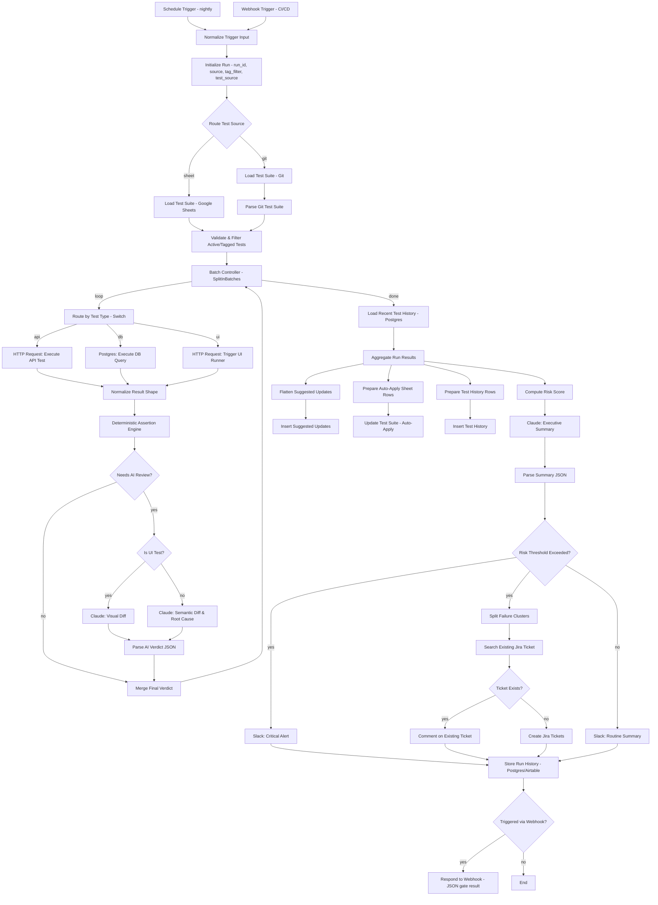

# Architecture — AI QA Regression Testing Agent (n8n)

## 1. Overview

The agent is a single n8n workflow (`qa-regression-agent.n8n.json`) built around a **hybrid verification model**:

```
Deterministic check (cheap, fast, exact) ──► PASS → done, no AI call
                                          └─► ambiguous / FAIL → escalate to Claude for semantic adjudication
```

This keeps cost and latency low (most passing tests never touch the LLM) while giving the system judgment on the cases that actually need it: dynamic fields, rewritten copy, "is this a real regression or a stale expectation."

On top of that core loop, six differentiating capabilities change what happens *around* each run: tests can come from a Sheet or a git-backed JSON file; escalations for UI tests get a multimodal (screenshot) adjudicator instead of text-only; the run's risk rating is computed deterministically and only narrated by the AI; stale-expectation fixes can be safely auto-applied within a narrow, audited envelope; failures and flakiness are tracked *across* runs, not just within one; and Jira tickets are de-duplicated across nights instead of re-filed. See §9 for design notes on each.

## 2. High-Level Flow Diagram



## 3. Node-by-Node Breakdown

### 3.1 Entry points
| Node | Type | Purpose |
|---|---|---|
| `Schedule Trigger` | `scheduleTrigger` | Fires nightly (cron, configurable). |
| `Webhook Trigger` | `webhook` (POST, `responseMode: responseNode`) | Fires on-demand from CI/CD with optional `{ tags: [], build_id, test_source }` body. |
| `Normalize Trigger Input` | `code` | Unifies both trigger shapes into `{ source, tags, build_id, test_source }`. `test_source` defaults to `'sheet'`; a webhook body can set it to `'git'`. |

### 3.2 Setup & test source
| Node | Type | Purpose |
|---|---|---|
| `Initialize Run` | `code` | Generates `run_id` (uuid), `started_at`, carries `tags`/`test_source` filter forward. |
| `Route Test Source` | `if` | `test_source === 'git'` → git-backed loader; otherwise (default) → Google Sheets. |
| `Load Test Suite` | `googleSheets` (read) | Reads all rows from the "Test Suite" tab. |
| `Load Test Suite (Git)` | `httpRequest` | Test-as-code alternative: GETs a JSON file (same `test_cases[]` shape as `sample_test_suite.json`) from a git raw URL. |
| `Parse Git Test Suite` | `code` | Maps git JSON rows into the same shape Sheet rows arrive in (tags → comma string, active → string) so downstream logic doesn't care which source was used. |
| `Validate & Filter Active/Tagged Tests` | `code` | Drops `active=false` rows, applies tag filter, **defensively `JSON.parse`s** `expected_schema`/`expected_key_values`/`headers`/`body` (Sheet/CSV cells arrive as JSON strings; git-sourced rows arrive as native objects — this node normalizes either), splits `dynamic_fields` on commas if it's a string, validates required fields per `test_type`, and routes invalid rows into a `skipped_invalid` collection reported later (never crashes the run). Carries `run_id`/`source`/`build_id` onto every row. |

### 3.3 Batch execution loop
| Node | Type | Purpose |
|---|---|---|
| `Batch Controller` | `splitInBatches` (batch size configurable, default 5) | Standard n8n loop pattern: `loop` output drives per-test processing; processing re-enters this node until all items consumed; `done` output fires once at the end. |
| `Route by Test Type` | `switch` | 3 branches: `api`, `db`, `ui` (+ default → mark unsupported, skip). |
| `Execute API Test` | `httpRequest` | Sends the configured method/endpoint/headers/body; captures status, headers, body, latency. `continueOnFail: true` so a non-2xx doesn't halt the workflow — failure is data, not an error. |
| `Execute DB Query` | `postgres` | Runs `db_query` for `test_type=db` cases. |
| `Trigger UI Runner` | `httpRequest` | POSTs `{ script_id }` to an external Playwright/Selenium microservice and receives back a structured result (`status`, `screenshot_match_score`, `extracted_text`, and — for the visual-diff feature — `baseline_screenshot_base64`/`current_screenshot_base64`). This keeps browser automation **out** of n8n itself — n8n orchestrates, a purpose-built runner executes. |
| `Normalize Result Shape` | `code` | Maps the three different raw shapes into one common `TestResult` object (see §5). |

### 3.4 Verification
| Node | Type | Purpose |
|---|---|---|
| `Deterministic Assertion Engine` | `code` | Checks: (a) status code match, (b) JSON-schema validation of the actual body against `expected_schema` (lightweight hand-rolled validator — checks `required` fields and, where a property `type` is declared, that the actual value matches), (c) exact match on every key in `expected_key_values` **except** paths listed in `dynamic_fields`, (d) threshold assertions for any `expected_key_values` key suffixed `_min`/`_max` (e.g. `count_min: 5`) — compared with `>=`/`<=` against the actual value at the base field name. Produces `{ deterministic_verdict, mismatches[] }`. |
| `Needs AI Review?` | `if` | True when `deterministic_verdict != PASS`, OR the test has `expected_key_values` containing a `*_semantic` key (pure semantic assertions always go to AI), OR a mismatch is confined entirely to `dynamic_fields` but the test is `priority=critical` (defense in depth on critical paths). |
| `Is UI Test?` | `if` | Only reached on escalation. `test_type === 'ui'` → multimodal visual diff; otherwise → text-only semantic diff. |
| `Claude - Visual Diff` | `httpRequest` → `api.anthropic.com/v1/messages` | UI-test escalations: sends baseline + current screenshots as base64 image content blocks alongside test metadata; asks Claude to describe what visually changed before judging. Same strict-JSON verdict contract as the text path, plus `visual_diff_description`. |
| `Claude - Semantic Diff` | `httpRequest` → `api.anthropic.com/v1/messages` | Non-UI escalations: sends a structured prompt (test metadata, expected, actual, mismatches, dynamic_fields, known_flaky) and requests a strict-JSON verdict. See §6 for the prompt contract. |
| `Parse AI Verdict` | `code` | Extracts/validates the JSON from Claude's text response (from either AI node); on parse failure, falls back to `verdict: NEEDS_REVIEW, confidence: 0`. |
| `Merge Final Verdict` | `code` | Combines deterministic result + (optional) AI verdict into the final per-test record, carrying `build_id` and `visual_diff_description` through; appends to the run's results array kept in workflow static data / passed along the loop. |

### 3.5 Aggregation, risk, and reporting
| Node | Type | Purpose |
|---|---|---|
| `Load Recent Test History` | `postgres` | Runs once, after the batch loop's `done` output. Pulls the last 5 runs per `test_id` from `qa_test_run_history` so `Aggregate Run Results` has cross-run signal to work with, not just this run's data. |
| `Aggregate Run Results` | `code` | Computes pass/fail/flaky/needs-review counts, clusters failures by `(root_cause_category)`, flags **chronically flaky tests** (`FLAKY` in ≥3 of the last 5 runs) and **recurring issues** (a `FAIL` whose root cause matches ≥2 prior runs, with the build it first appeared in), and classifies every `STALE_EXPECTATION` suggestion into `auto_apply` vs `manual_review` (see §9.2 for the eligibility rule). Never mutates anything itself — purely classification. |
| `Compute Risk Score` | `code` | Computes `risk_score` (0–100, weighted from fail/needs-review/flaky counts, a critical-path override, and recurring/chronic-issue counts) and the corresponding `risk_rating` — **deterministically, before the AI sees the run**. |
| `Claude - Executive Summary` | `httpRequest` | Given the aggregated stats, the already-final `risk_score`/`risk_rating`, and the chronic/recurring signals, produces `headline`, `top_risks[]`, `narrative` — it does not choose the rating. |
| `Parse Summary JSON` | `code` | Validates/parses the summary response and merges it onto the `Compute Risk Score` output (spread first) so a malformed AI response can degrade the narrative but never the risk rating. |
| `Risk Threshold Exceeded?` | `if` | True if `risk_rating` in `{HIGH, CRITICAL}` or any `priority=critical` test has `verdict=FAIL`. |
| `Slack - Critical Alert` | `slack` | Posts to an incident/QA-critical channel, @-mentions the on-call/QA lead group; includes risk score and chronic/recurring counts when present. |
| `Split Failure Clusters` | `code` | One item per failure cluster; computes a stable `cluster_label` (hash of root-cause category + sorted test IDs) used for Jira de-duplication. |
| `Search Existing Jira Ticket` | `httpRequest` (Jira REST search) | JQL search for an open issue already carrying this run's `cluster_label`. |
| `Ticket Exists?` | `if` | Routes to a comment vs. a new ticket based on the search result. |
| `Comment on Existing Ticket` | `httpRequest` (Jira REST) | Appends "still failing as of run X" to the existing issue instead of filing a duplicate. |
| `Create Jira Tickets` | `httpRequest` (Jira REST) | Only reached when no existing ticket matched; tags the new issue with `cluster_label` so future runs recognize it. |
| `Slack - Routine Summary` | `slack` | Posts the narrative summary to the normal QA channel — no paging. |
| `Flatten Suggested Updates` → `Insert Suggested Updates` | `code` → `postgres` | Writes every `STALE_EXPECTATION` suggestion (auto-applied or not) to `qa_suggested_updates`, pre-quoted for a raw-SQL insert. |
| `Prepare Auto-Apply Sheet Rows` → `Update Test Suite (Auto-Apply)` | `code` → `googleSheets` | For the narrow `auto_apply` subset only: patches just the one changed field onto the test's existing `expected_key_values` and writes it back to the live sheet, matched by `test_id`. |
| `Prepare Test History Rows` → `Insert Test History` | `code` → `postgres` | Writes this run's per-test verdicts to `qa_test_run_history` so the *next* run's `Load Recent Test History` has something to compare against. |
| `Store Run History` | `postgres` (or `airtable`) | Persists run-level history (now including `risk_score`) for trend analysis, regardless of which reporting branch fired. |
| `Respond to Webhook` | `respondToWebhook` | Only reached if `source=webhook`; returns `{ run_id, status, risk_score, pass_count, fail_count, risk_rating }` so a CI/CD pipeline can gate on it. |

## 4. The Batch Loop Pattern (important n8n detail)

`SplitInBatches` in n8n has two outputs: **loop** (current batch's items, to be processed) and **done** (fires once, after all batches are exhausted). The processing chain (`Route by Test Type` → … → `Merge Final Verdict`) must feed **back into the input of `Batch Controller`**, not into a separate downstream node, or the loop won't advance. `Load Recent Test History` connects only to the **done** output, followed by `Aggregate Run Results`. Both of those, and every node further downstream in the reporting/history/suggestion branches, reference `$('Batch Controller').all()` directly (an ancestor two-plus hops back) to get the definitive list of this run's per-test results, rather than relying on whatever happens to be the immediate input — this is the same non-immediate-ancestor `$('NodeName')` pattern already used elsewhere in the workflow (e.g. `Validate & Filter Tests` reading `$('Initialize Run')`). This is the standard n8n "process N items in controlled batches" pattern and is what keeps concurrency bounded against the target test environment.

## 5. Common `TestResult` Data Contract

Every branch normalizes to this shape before hitting the Deterministic Assertion Engine:

```json
{
  "test_id": "TC-004",
  "test_type": "api",
  "priority": "critical",
  "expected": { "status": 200, "schema": {...}, "key_values": {...}, "dynamic_fields": [...] },
  "actual": { "status": 200, "body": {...}, "latency_ms": 214 },
  "known_flaky": false
}
```

And after verdict merge:

```json
{
  "test_id": "TC-004",
  "verdict": "FAIL",
  "source": "ai",
  "confidence": 0.92,
  "root_cause_category": "REGRESSION",
  "reasoning": "Discount was expected to reduce total to 143.98 but actual total is 151.98 — the 10% discount does not appear to have been applied to the subtotal.",
  "mismatches": [{ "field": "total", "expected": 143.98, "actual": 151.98 }],
  "suggested_expected_value": null,
  "visual_diff_description": null,
  "run_id": "run_2026-07-03T02:00:00Z_a1b2",
  "build_id": "1234",
  "duration_ms": 214
}
```

## 6. AI Prompt Contracts

### 6.1 Per-test semantic adjudication (text)
System instruction (fixed): Claude is told it is a senior QA engineer adjudicating a single regression test result, must consider the listed `dynamic_fields` as expected-to-vary, must not treat cosmetic/wording differences as failures unless they change meaning, and **must respond with strict JSON only**, matching a given schema (`verdict`, `confidence`, `root_cause_category`, `reasoning`, `suggested_expected_value`).

`root_cause_category` enum: `REGRESSION | FLAKY | TEST_DATA_ISSUE | ENV_ISSUE | STALE_EXPECTATION`.

Low-temperature call (`temperature: 0`) for consistency; response is parsed defensively (strip code fences, `JSON.parse`, catch → `NEEDS_REVIEW`).

### 6.2 Per-test semantic adjudication (visual)
Same JSON contract plus `visual_diff_description`. Input is multimodal: a text block with test metadata/mismatches, plus two image blocks (baseline, current screenshot, base64 PNG). System instruction adds: describe concretely what changed before judging, and never fail solely on a field listed in `dynamic_fields` (e.g. a rotating promo banner).

### 6.3 Executive summary
Given the full run's aggregated counts, the list of individual verdicts (not raw payloads, to keep the prompt small), and the **already-computed** `risk_score`/`risk_rating`/`chronic_flaky`/`recurring_issues`, Claude produces a short narrative plus `headline`/`top_risks[]` — it is explicitly instructed not to contradict the given rating. This call happens once per run regardless of suite size, so cost stays flat as the suite grows.

## 7. Error Handling & Resilience

- **Individual HTTP test failures are data, not workflow errors** (`continueOnFail: true` on execution nodes) — a 500 from the system under test is exactly what we want to observe and classify, not something that should crash the agent.
- **One automatic retry** is built into the Deterministic Assertion Engine for tests marked `known_flaky: true`: on first failure, the engine schedules a single re-execution (loop back through the router) before finalizing; if the retry passes, verdict is set to `FLAKY` rather than `PASS`/`REGRESSION`.
- **AI call failures** (timeout, malformed JSON, non-2xx from Anthropic API) fall back to `verdict: NEEDS_REVIEW, confidence: 0, root_cause_category: ENV_ISSUE` — the run still completes and is visible, never silently dropped. This applies equally to `Claude - Visual Diff`.
- **Executive-summary AI failures** fall back to a placeholder narrative but **never** lose the deterministic `risk_score`/`risk_rating`, since `Parse Summary JSON` spreads the `Compute Risk Score` output first and only overlays the AI's narrative fields on top.
- **Malformed sheet rows** are filtered out at load time and listed in the summary under "Skipped — invalid configuration," never crash the batch loop. This applies to both the Sheet and git-backed sources.
- **Ticket de-duplication**: `Split Failure Clusters` + `Search Existing Jira Ticket` prevent both same-run ticket storms (clustering by root cause) and cross-run duplicate tickets (stable `cluster_label` lookup) during a systemic outage.
- **Auto-apply failures**: if `Update Test Suite (Auto-Apply)` fails (e.g. bad credential), `continueOnFail: true` lets the run finish and report normally — the suggestion is still recorded in `qa_suggested_updates` regardless, so nothing is lost, just not yet applied.

## 8. Security

- All credentials (Anthropic API key, Google Sheets OAuth, Postgres, Slack bot token, Jira API token, optional git PAT) are stored exclusively in **n8n Credentials**, referenced by ID in node parameters — never embedded in sheet data, prompts, or logs.
- The webhook trigger should be protected with an n8n **Header Auth** credential (shared secret) so only the CI/CD system can invoke on-demand runs.
- Request/response bodies sent to Claude are limited to test-relevant fields; avoid putting real user PII in `body`/`expected_key_values` — use synthetic QA accounts (as in the sample data, `qa.regression@example.com`). The same applies to screenshots sent to `Claude - Visual Diff`: use synthetic UI fixtures, not screens containing real user data.
- The AI is never given write-capable tools or credentials — it returns JSON text only; all mutations (ticket creation, DB writes, the narrow sheet auto-apply) happen in deterministic n8n nodes after parsing, and every mutation the AI's output can trigger (auto-apply, tickets) is logged for audit.

## 9. Differentiator Design Notes

### 9.1 Cross-run pattern intelligence
The key design choice is that history lives in its own table (`qa_test_run_history`, one row per test per run) rather than being reconstructed from `qa_run_history` (which is run-level only). `Load Recent Test History` uses a window function (`ROW_NUMBER() OVER (PARTITION BY test_id ...)`) to fetch exactly the last 5 rows per test in one query rather than N queries — cheap regardless of suite size. Thresholds (`>=3 of 5` for chronic flaky, `>=2 prior` for recurring) are constants in `Aggregate Run Results`; tune them there.

### 9.2 Tiered autonomy
The auto-apply eligibility rule is deliberately conservative and lives in one place (`Aggregate Run Results`): `singleMismatch && priority !== 'critical' && confidence >= 0.95 && !PROTECTED_FIELD_PATTERN.test(field)`. Multi-field mismatches are excluded because attributing a `suggested_expected_value` to the "right" field when several disagree is ambiguous — those always go to manual review. The protected-field regex is a blunt but legible guardrail; extend it per-domain (e.g. add `inventory|quantity` for a warehouse system) rather than trying to make it "smart."

### 9.3 Deterministic risk scoring
Risk scoring intentionally does not ask Claude to pick `LOW/MEDIUM/HIGH/CRITICAL` — that decision is now arithmetic, so the same run inputs always produce the same rating, and a flaky/inconsistent LLM response can only cost you a worse narrative, never a wrong go/no-go signal. If you want the AI to *challenge* the deterministic score (e.g. flag "this looks worse than the score suggests"), that's a reasonable v2 extension — have it return an optional `dissent` field the release manager can see, without ever letting it overwrite `risk_rating`.

### 9.4 Multimodal visual diffing
This depends entirely on your external UI runner returning screenshots, not just a similarity score — it's a contract change to that microservice, not something n8n can synthesize. If your runner can't easily return raw images (e.g. it only stores them in S3), pass signed URLs instead of base64 and switch the image content block's `source.type` to `url`.

### 9.5 Test-as-code source
Deliberately scoped to JSON, not YAML, because n8n's sandboxed Code node can't `require('js-yaml')` without the instance operator enabling `NODE_FUNCTION_ALLOW_EXTERNAL` — a JSON test file needs zero extra dependencies and round-trips through `sample_test_suite.json`'s existing shape unchanged. `Route Test Source` is a per-run switch, not a permanent choice, so a team can pilot git-backed tests on one tag/service while everything else stays on the Sheet.

### 9.6 Jira ticket de-duplication
`cluster_label` is a pure function of `(root_cause_category, sorted test_ids)` — same cluster, same label, every run, with no external state needed to compute it. The tradeoff: if the *set* of failing tests in a recurring cluster changes even slightly (one more test starts failing for the same reason), it hashes to a different label and will file a new ticket rather than commenting on the old one. That's an intentional bias toward under- rather than over-merging — a changed failure set is itself a signal worth a human noticing.

## 10. Extensibility

- **New test type** (e.g., GraphQL, gRPC): add a branch to `Route by Test Type`, an execution node, and a mapping case in `Normalize Result Shape`. Nothing downstream changes.
- **Different LLM/provider**: the AI nodes are plain `httpRequest` calls to a documented JSON contract — swapping to a different model/provider means changing the URL/auth and prompt template only.
- **Different ticketing system**: `Search Existing Jira Ticket` / `Comment on Existing Ticket` / `Create Jira Tickets` can be swapped for Linear/GitHub Issues equivalents; the cluster object contract (including `cluster_label`) stays the same.
- **Different test source**: add another branch off `Route Test Source` (e.g. Notion, Airtable) following the same "normalize to the Sheet row shape, then feed `Validate & Filter Tests`" pattern used by the git loader.
- **Dashboarding**: `Store Run History` / `qa_test_run_history` / `qa_suggested_updates` are all normalized tables; any BI tool (Looker Studio, Metabase, or just Sheets pivot tables) can sit on top without workflow changes.

## 11. Cost & Performance Notes

- AI is invoked at most twice per test (adjudication, text or visual) and once per run (summary) — never per-field, never on clean passes.
- Batch size and per-request timeout are the two levers for tuning run duration against a given target environment's capacity.
- `temperature: 0` on adjudication calls (text and visual) keeps verdicts stable/reproducible across re-runs of the same failure.
- `Load Recent Test History` is one indexed query per run, not per test — cost does not scale with suite size.
- Jira de-duplication trades one extra `httpRequest` (search) per failure cluster for avoiding N duplicate ticket creations across recurring nightly failures — a net reduction in Jira API calls over any multi-night outage.
